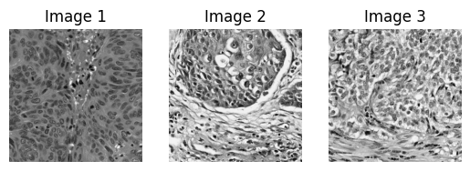

# binarization, morphological operations, image filtrations  
Name: Erik Matovič  
Methods used: list of important methods

## Assignment
Load histology image from breast cancer dataset  - [image1](https://drive.google.com/file/d/15o6Dl25P6ern4JJkjArxpPdi8UPLcF6p/view), [image2](https://drive.google.com/file/d/1hHTTYJX6qyzY0BJbLQ21bx69Mj7LFrOv/view), [image3](https://drive.google.com/file/d/1UXCh_8nucjo5zA7-WqrJ_JNzmQkhO5am/view). 
Eliminate noise and binarize the image using morphological operations and contour analysis. 
Try to programmatically mark every cell and sum the total count. There are multiple solutions, use your imagination. Document each attempt, 
even if it is unsuccessful ([documentation example](https://sites.google.com/stuba.sk/vgg/computer-vision/solution-training-task?authuser=0)).
Use [OpenCV documentation](https://docs.opencv.org/4.7.0/), below are some tips you may try.
Optional Datasets: [Beer bubbles](https://drive.google.com/file/d/1jg_o5izpma-RUc8296SOjPau5ypruWnE/view), [red blood cells](https://drive.google.com/drive/folders/1FThJGItE_jSzne2LgcStj9Q4sLILPDWj)
Choose at least 2 images (of your choice) for this Assignment !

## Usage
To run Jupyter Notebook, you need OpenCV and matplotlib. You can install them using pip:  
```bash
pip install opencv-python matplotlib
```

## Solution
### 1. Load image and convert to grayscale
After loading images, we downsized histological images up to half their size and converted them to grayscale.

```python
img1_grayscale = cv2.cvtColor(img1_resize, cv2.COLOR_BGR2GRAY)
img2_grayscale = cv2.cvtColor(img2_resize, cv2.COLOR_BGR2GRAY)
img3_grayscale = cv2.cvtColor(img3_resize, cv2.COLOR_BGR2GRAY)
```

<p align="center">
	
</p>

### 2. Image pre-processing

### 3. Binarization

### 4. Bubble segmentation

### Filtration
