# Cell segmentation using binarization, morphological operations, image filtrations  
Name: Erik Matovič  
Methods used: resampling(resizing image), noise removal by blurring, thresholding, edge detection, morphological operations, contour analysis, image filtration

## Assignment
Load histology image from breast cancer dataset  - [image1](https://drive.google.com/file/d/15o6Dl25P6ern4JJkjArxpPdi8UPLcF6p/view), [image2](https://drive.google.com/file/d/1hHTTYJX6qyzY0BJbLQ21bx69Mj7LFrOv/view), [image3](https://drive.google.com/file/d/1UXCh_8nucjo5zA7-WqrJ_JNzmQkhO5am/view). 
Eliminate noise and binarize the image using morphological operations and contour analysis. 
Try to programmatically mark every cell and sum the total count. There are multiple solutions, use your imagination. Document each attempt, 
even if it is unsuccessful ([documentation example](https://sites.google.com/stuba.sk/vgg/computer-vision/solution-training-task?authuser=0)).
Use [OpenCV documentation](https://docs.opencv.org/4.7.0/).
Optional Datasets: [Beer bubbles](https://drive.google.com/file/d/1jg_o5izpma-RUc8296SOjPau5ypruWnE/view), [red blood cells](https://drive.google.com/drive/folders/1FThJGItE_jSzne2LgcStj9Q4sLILPDWj)
Choose at least 2 images (of your choice) for this Assignment

## Usage
To run Jupyter Notebook, you need OpenCV and matplotlib. You can install them using pip:  
```bash
pip install opencv-python matplotlib
```

## Solution
### 1. Load image and convert to grayscale
After loading images, we downsized histological images up to half their size and converted them to grayscale.

Function for resizing images and for displaying images:
```python
def show_img(img: cv2.Mat, txt: str) -> None:
    """
    Show images
    :param: img - image
    :param: txt - text of a window
    """
    cv2.imshow(txt, img)
    cv2.waitKey(0)
    cv2.destroyAllWindows()
    
def resize_img(img: cv2.Mat, scale_percent: int) -> cv2.Mat:
    """
    Resizing images.
    :param: img - image
    :param: scale_percent - percent by which the image is resized
    :return: Resized image
    """
    # calculate the scale percent of original dimensions
    width = int(img.shape[1] * scale_percent / 100)
    height = int(img.shape[0] * scale_percent / 100)

    # dsize
    dsize = (width, height)

    img_resize = cv2.resize(img, dsize)
    return img_resize
```

Conversion to grayscale:
```python
img1_grayscale = cv2.cvtColor(img1_resize, cv2.COLOR_BGR2GRAY)
img2_grayscale = cv2.cvtColor(img2_resize, cv2.COLOR_BGR2GRAY)
img3_grayscale = cv2.cvtColor(img3_resize, cv2.COLOR_BGR2GRAY)
```

Original images:  
<p align="center">
	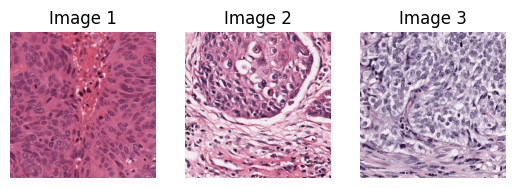
</p>

Grayscale images:  
<p align="center">
	
</p>

### 2. Image pre-processing  
Noise removal with blurring for 3 images:  
```python
img_blur = cv2.blur(img_grayscale, (5,5))
img_gauss = cv2.GaussianBlur(img_grayscale, (5,5), 0)
img_median = cv2.medianBlur(img_grayscale, 5)
img_bilateral = cv2.bilateralFilter(img_grayscale, 9, 75, 75)
```

<p align="center">
	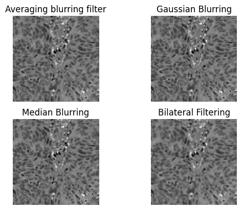
	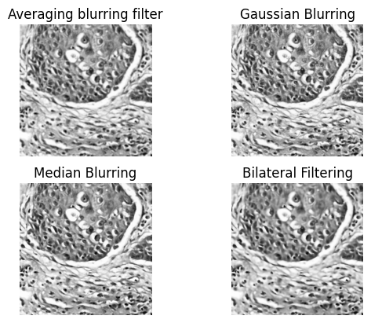
	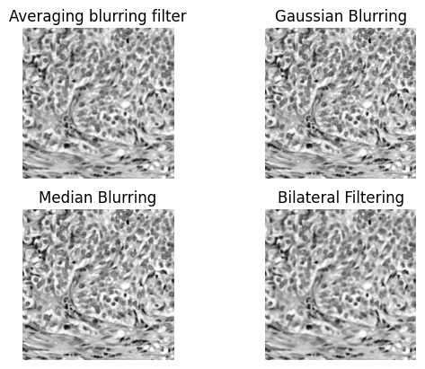
</p>

Sharpening image with sharpening kernel defined from Laplacian kernel:

```python
# show original image
show_img(img1_grayscale, 'img1 grayscale')

# create a sharpening kernels
sharpening_kernel1 = np.array([
    [-1,-1,-1],
    [-1, 9,-1],
    [-1,-1,-1]
])

sharpening_kernel2 = np.array([
    [0,-1, 0],
    [-1,5,-1],
    [0,-1, 0]
])

# convolution
img1_sharpening1 = cv2.filter2D(img1_grayscale ,-1, sharpening_kernel1)
img1_sharpening2 = cv2.filter2D(img1_grayscale ,-1, sharpening_kernel2)
show_img(img1_sharpening1, 'img1_sharpening1')
show_img(img1_sharpening2, 'img1_sharpening2')
```

<p align="center">
	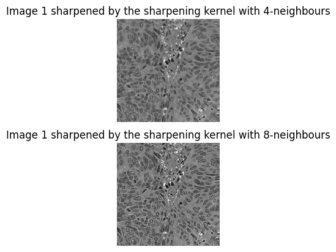
</p>

### 3. Binarization
Binarization of image 1 using thresholding & inrage after gaussian blurring:  

```python
retValue, img1_threshold = cv2.threshold(img1_gauss, 127, 255, cv2.THRESH_BINARY)
retValue, img1_otsu = cv2.threshold(img1_gauss, 0, 255, cv2.THRESH_OTSU)
img1_adaptiveThreshold = cv2.adaptiveThreshold(img1_gauss, 255, cv2.ADAPTIVE_THRESH_MEAN_C, cv2.THRESH_BINARY, 11, 0)
img1_inrange = cv2.inRange(img1_gauss, 127, 255)
```

<p align="center">
	
</p>

Binarization of image 2 using thresholding & inrage after bilateral blurring: 
 
```python
retValue, img2_threshold = cv2.threshold(img2_bilateral, 127, 255, cv2.THRESH_BINARY)
retValue, img2_otsu = cv2.threshold(img2_bilateral, 0, 255, cv2.THRESH_OTSU)
img2_adaptiveThreshold = cv2.adaptiveThreshold(img2_bilateral, 255, cv2.ADAPTIVE_THRESH_MEAN_C, cv2.THRESH_BINARY, 11, 0)
img2_inrange = cv2.inRange(img2_bilateral, 127, 255)
```

<p align="center">
	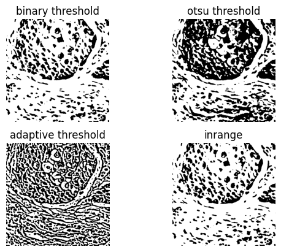
</p>

Binarization of image 3 using thresholding & inrage after median blurring: 
 
```python
retValue, img3_threshold = cv2.threshold(img3_median, 127, 255, cv2.THRESH_BINARY)
retValue, img3_otsu = cv2.threshold(img3_median, 0, 255, cv2.THRESH_OTSU)
img3_adaptiveThreshold = cv2.adaptiveThreshold(img3_median, 255, cv2.ADAPTIVE_THRESH_MEAN_C, cv2.THRESH_BINARY, 11, 0)
img3_inrange = cv2.inRange(img3_median, 127, 255)
```

<p align="center">
	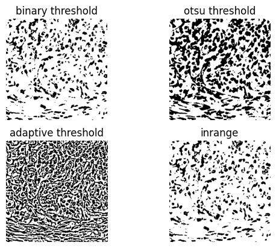
</p>

Binarization of image 1 using Sobel edge detection after gaussian blurring:  
```python
grad_x = cv2.Sobel(src=img1_gauss, ddepth=-1, dx=1, dy=0, ksize=3)
grad_y = cv2.Sobel(src=img1_gauss, ddepth=-1, dx=0, dy=1, ksize=3)
abs_grad_x = cv2.convertScaleAbs(grad_x)
abs_grad_y = cv2.convertScaleAbs(grad_y)
grad = cv2.addWeighted(abs_grad_x, 0.5, abs_grad_y, 0.5, 0)
```

Binarization of image 1 using Laplacian & Canny edge detection after gaussian blurring:   
```python
img1_laplac = cv2.Laplacian(src=img1_gauss, ddepth=-1, ksize=7)
img1_canny = cv2.Canny(img1_gauss, 30, 100)
```

Compare edge detection with adaptive thresholding after gaussian blurring:
<p align="center">
	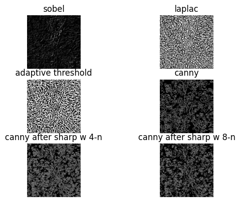
</p>

### 4. Cell segmentation
Using morphological operations after Canny Edge Detection:
```python
img1_dilate = cv2.dilate(img1_canny,(-1, -1), 3)
img1_erode = cv2.erode(img1_canny, kernel=(3,3))
img1_distanceTransform = cv2.distanceTransform(src=img1_canny, distanceType=cv2.DIST_L2, maskSize=5)
```

<p align="center">
	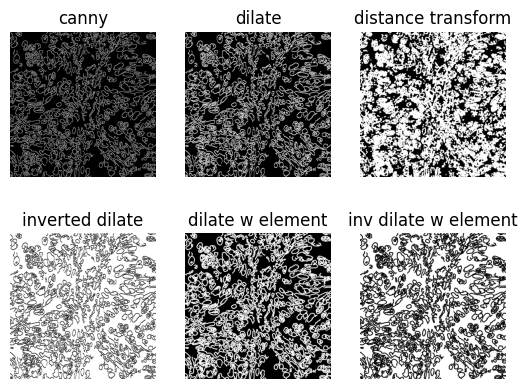
</p>

Function for contour analysis:
```python
def contours(img: cv2.Mat, img_input: cv2.Mat, mode: Any, method: int) -> Tuple[cv2.Mat, int]:
    """
    Countour analysis
    :param: img - original image
    :param: img_input - image after morphological operation
    :param: mode - mode in cv2.findContours
    :param: method - method in cv2.findContours
    :returns: tuple of resulting image and number of cells
    """
    img_result = img.copy()
    img_contours, img_hierarchy = cv2.findContours(img_input, mode, method)
    cell_count = 0

    for i in range(0, len(img_contours)):
        if cv2.contourArea(img_contours[i]) > 10:
            cell_count += 1
            cv2.drawContours(img_result, img_contours, i, (0, 255, 0), 4)
        i += 1
    return img_result, cell_count
```

Contours analysis of image 1 after dilating binary image from Canny Edge Detection: 
<p align="center">
	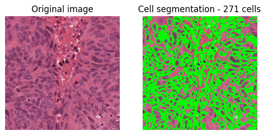
</p>

Contours analysis of image 2 after dilating binary image from Adaptive Threshold: 
<p align="center">
	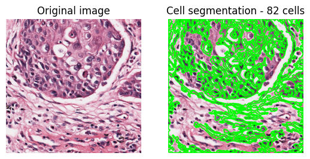
</p>

Contours analysis of image 2 after eroding binary image from Adaptive Threshold: 
<p align="center">
	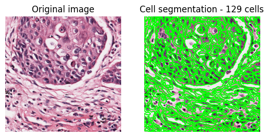
</p>

Contours analysis of image 3 after eroding binary image from Laplac edge detection: 
<p align="center">
	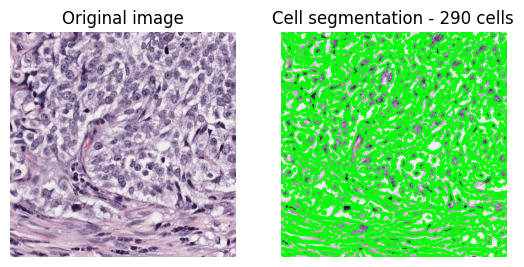
</p>

### Filtration
TO DO

## Conclusion  
We have used three methods on three images. The first image used Gaussian blurring, Canny Edge Detection, and dilate operation for contour analysis. The second image used bilateral blurring, adaptive thresholding as binarization, and dilate/erode operation for contour analysis. Erode process showed more potential for segmentation because it segmented more cells. The third image used median blurring, Laplac edge detection, and erode operation for contour analysis.

